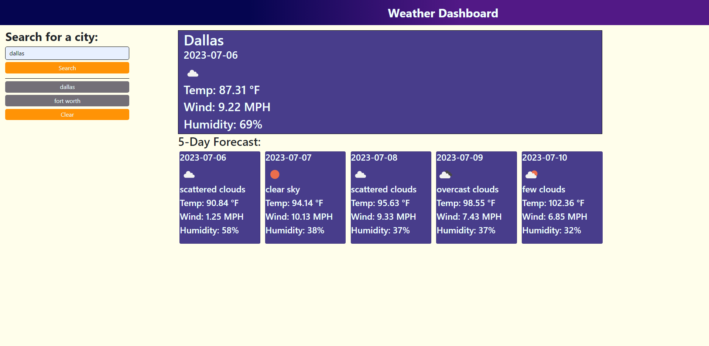

# Weather-App

https://ryanthescholar.github.io/Weather-App/

## Description

My motivation for this project was to learn API implementation in a dynamic format. I built this for users who want a current day forecast and birds eye view of the week with a five day forecast. I learned how to connect an API to the script file and access the data via the fetch method and .then method to nest functions in a function. This solves weather data issues for the user as the user can pull the weather data from 200,000 locations according to OpenWeatherAPI.

## Table of Contents (Optional)

- [Installation](#installation)
- [Usage](#usage)
- [Credits](#credits)
- [License](#license)

## Installation

N/A

## Usage

## Credits

N/A

## License

N/A

## Badges

## Features

N/A

## How to Contribute

Ryan.business.bowen@gmail.com

## Tests

N/A